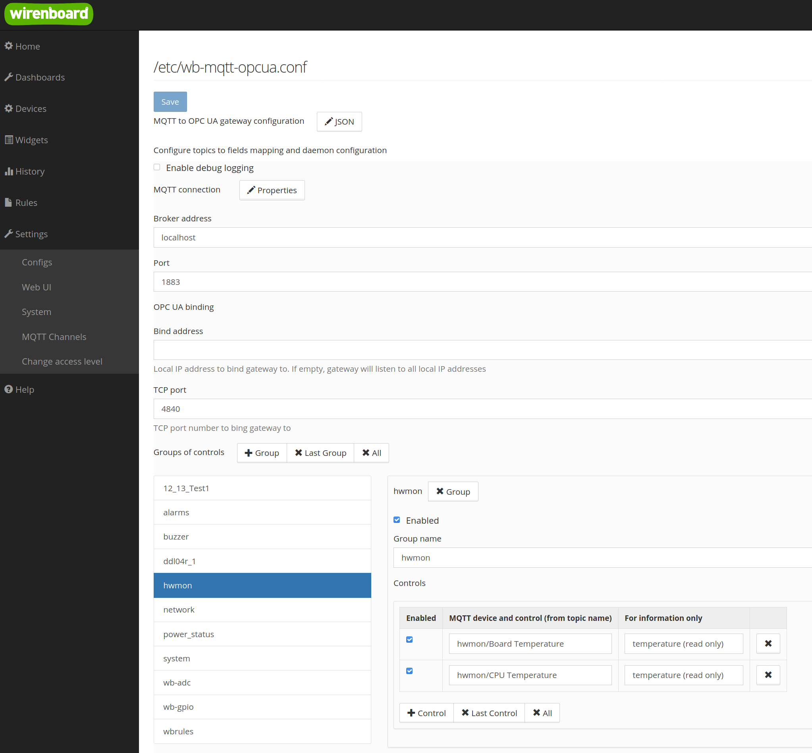

# wb-mqtt-opcua
MQTT to OPC UA gate for Wirenboard which follows [Wiren Board MQTT Conventions](https://github.com/wirenboard/homeui/blob/master/conventions.md).
It's designed to be used on [Wiren Board](https://wirenboard.com/en) family of programmable automation controllers (PACs).

Шлюз предназначен для трансляции сообщений между MQTT брокером и системами с поддержкой протокола [OPC UA](https://opcfoundation.org/about/opc-technologies/opc-ua/).
Шлюз предназначен для устройств [Wiren Board](https://wirenboard.com/ru) и соответствует [Конвенции Wiren Board MQTT](https://github.com/wirenboard/homeui/blob/master/conventions.md).

Запускается командой `systemctl start wb-mqtt-opcua` или `service wb-mqtt-opcua start`

По умолчанию запуск шлюза происходит при загрузке системы. При запуске шлюза происходит автоматическое создание конфигурационного файла `/etc/wb-mqtt-opcua.conf`. При последующих запусках шлюз анализирует доступные MQTT каналы(контролы) и добавляет их в файл. Активировать передачу данных конкретных каналов можно, редактируя `/etc/wb-mqtt-opcua.conf`, либо воспользовавшись онлайн-редактором настроек.

Шлюз подключается к заданому MQTT брокеру и подписывается на сообщения от каналов, указанных в конфигурационном файле. В системах с поддержкой протокола OPC UA выступает в роли сервера и принимает входящие TCP/IP соединения по указаному в конфигурационном файле локальному интерфейсу и порту.

Возможен запуск шлюза вручную, что может быть полезно для работы в отладочном режиме:
```
# service wb-mqtt-opcua stop
# wb-mqtt-opcua -d 3
```

Для контролов, доступных для записи (подтопик `/meta/readonly` равный `0`), шлюз производит передачу значений, записанных в OPC UA узлы, в соответствующие `on`-топики.

<div style="page-break-after: always;"></div>

### Структура конфигурационного файла

```javascript
{
  // Включает/выключает выдачу отладочной информации во время работы шлюза.
  "debug" : false,

  // Настройки протокола OPCUA.
  // Если настройки не заданы, то шлюз будет ожидать 
  // соединения по всем доступным локальным адресам на порту 4840.
  "opcua" : {
    // Локальный адрес, на котором шлюз будет ожидать входящие соединения.
    // Если задана пустая строка, то шлюз будет ожидать 
    // соединения по всем доступным локальным адресам.
    "host" : "",

    // Порт для входящих соединений.
    "port" : 4840
  },

  // Настройки подключения к MQTT брокеру.
  "mqtt" : {
    // Доменное имя или IP адрес брокера. По умолчанию, "localhost".
    "host" : "localhost",

    // Порт брокера. По умолчанию, 1883.
    "port" : 1883,

    // Интервал посылки keep-alive сообщений в секундах. По умолчанию, 60.
    "keepalive": 60,

    // Требуется ли аутентификация при подключении к брокеру.
    // По умолчанию, false.
    "auth": false,

    // Имя пользователя при подключении к брокеру.
    "username": ""

    // Пароль при подключении к брокеру.
    "password": ""
  }

  // Список групп каналов, для которых осуществляется пересылка сообщений.
  // Позволяет включать/отключать пересылку сообщений для нескольких каналов,
  // редактируя только один параметр "enabled".
  "groups" : [
    {
      // Включение/отключение пересылки сообщений каналов группы.
      // Для активации пересылки надо включить конкретные каналы.
      "enabled" : true,
  
      // Имя группы.
      "name" : "buzzer",

      // Список каналов в группе.
      "controls" : [
        {
          // Включение/отключение пересылки сообщений канала.
          // Также должа быть включена пересылка на уровне группы.
          "enabled" : true,

          // Имя устройства и канала в терминах MQTT конвенции,
          // разделённые символом "/". В конкретном случае,
          // соответствующая MQTT-тема /devices/buzzer/controls/volume
          "topic" : "buzzer/volume",

          // Тип канала (/devices/+/controls/+/meta/type) и возможность 
          // записи в него (/devices/+/controls/+/meta/readonly).
          // Используется для информации в интерфейсе онлайн-редактора
          // настроек. Не имеет влияния на работу шлюза.
          "info" : "range (setup is allowed)"
        },
        ...
      ]
    },
    ...
  ]
}
```

<div style="page-break-after: always;"></div>

### Интерфейс онлайн-конфигуратора

После установки шлюза его можно настроить в интерфейсе [онлайн-конфигуратора](https://wirenboard.com/wiki/%D0%92%D0%B5%D0%B1-%D0%B8%D0%BD%D1%82%D0%B5%D1%80%D1%84%D0%B5%D0%B9%D1%81_Wiren_Board#Settings_-.3E_Configs_.28.D0.9D.D0.B0.D1.81.D1.82.D1.80.D0.BE.D0.B9.D0.BA.D0.B8_-.3E_.D0.9A.D0.BE.D0.BD.D1.84.D0.B8.D0.B3.D1.83.D1.80.D0.B8.D1.80.D0.BE.D0.B2.D0.B0.D0.BD.D0.B8.D0.B5.29), выбрав из списка файл `/etc/wb-mqtt-opcua.conf`.

Онлайн-конфигуратор позволяет указать параметры подключения к MQTT-брокеру (дополнительные параметры можно выбрать, нажав на кнопку "Properties") и выбрать локальный IP и порт, по которым шлюз будет ожидать подключения.



Ниже расположен интерфейс редактирования списка групп и каналов для трансляции из MQTT в OPC UA. По умолчанию шлюз создаёт отдельную группу для каждого устройства. Список групп расположен слева, его можно самостоятельно редактировать.

При выборе конкретной группы в правой части появится список входящих в неё каналов. Каналы так же можно создавать, удалять и редактировать. Столбец "MQTT device and control" указывает конкретный канал MQTT. Он формируется из названия устройства и канала. Для первого в списке канала соотвествующий топик MQTT будет `/devices/hwmon/controls/Board Temperature`.

[Пример настройки получения данных в MasterScada 3.x](docs/MasterScada/MasterScada.md)