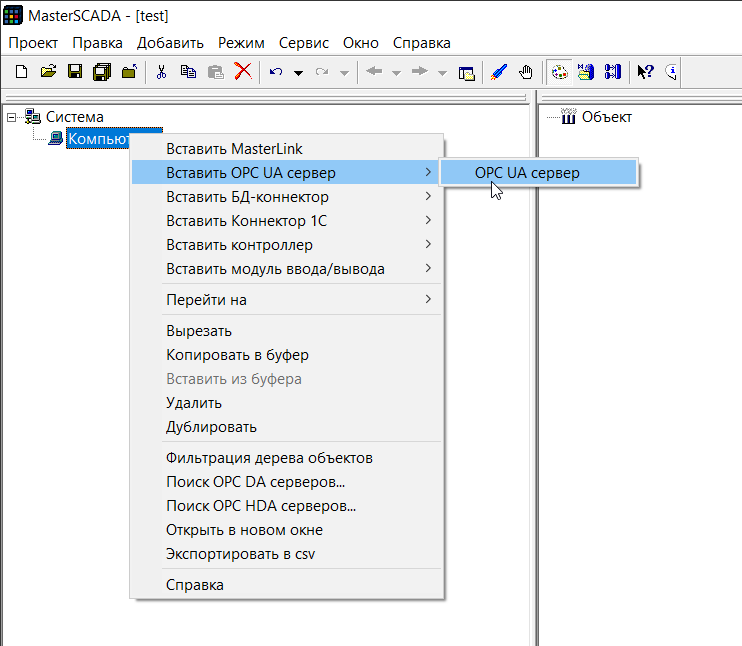
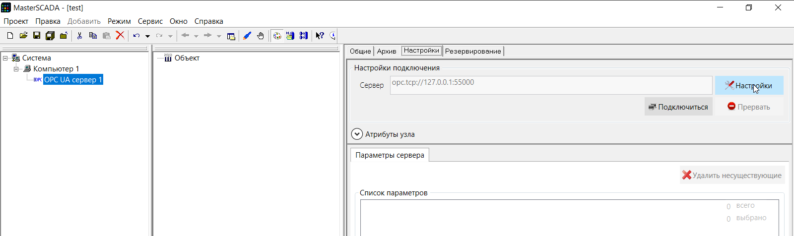
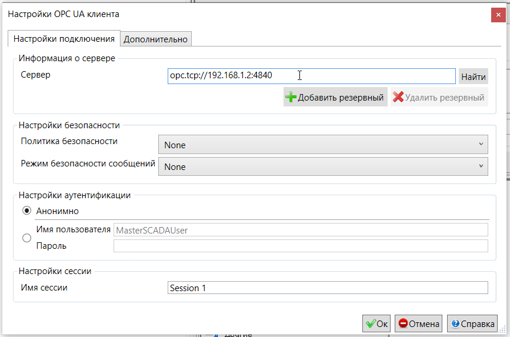
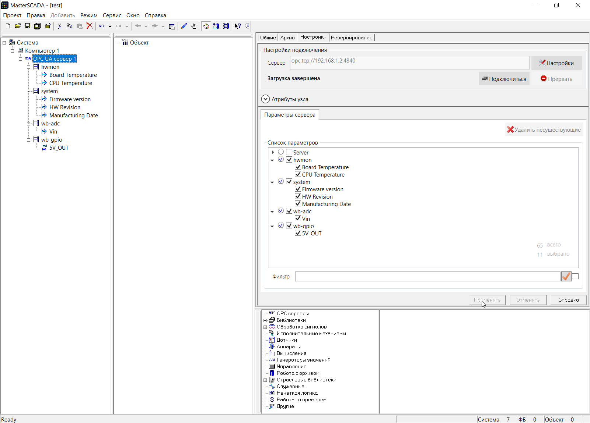
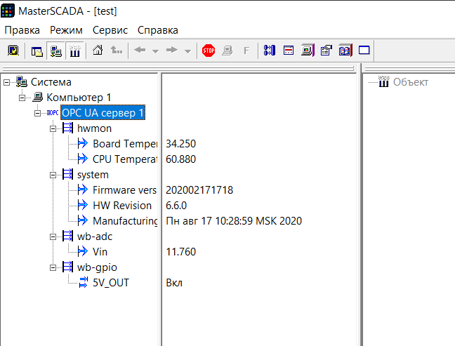

# Настройка MasterScada 3.x

Создайте новый проект, в нём вставьте компьютер, далее `Вставить OPC UA сервер`.

В настройках измените `Настройки подключения`.

Укажите адрес и порт OPC-сервера контроллера.

После нажатия кнопки `Подключиться`, будут загружены доступные узлы. Выберите те, с которыми будете работать, и нажмите `Применить`. Они появятся слева в дереве.

Проверить получаемые данные можно, запустив проект.

